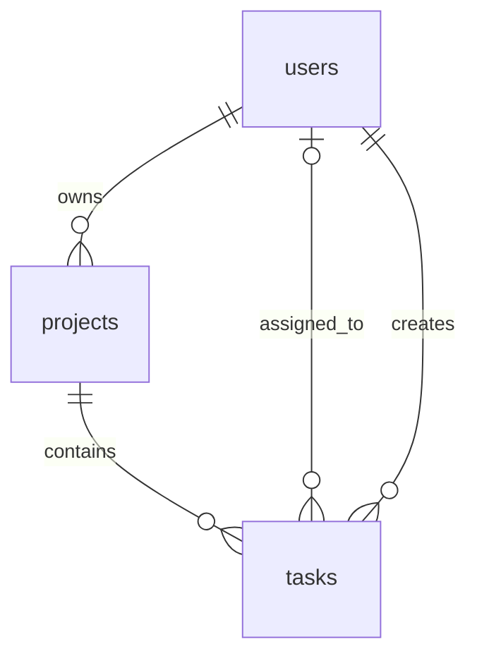

# TaskFlow

**A PHP and MySQL workspace for managing projects, tasks, and team activity.**

TaskFlow brings task lists, a Kanban board, a calendar, workload summaries, reports, and an Admin Console into one application. It runs locally with XAMPP and stores application data in MySQL or MariaDB.

> This README describes the implementation documented in the supplied project notes. It is not a source-code audit or a record of completed tests.

## Contents

- [Features](#features)
- [Technology stack](#technology-stack)
- [Getting started](#getting-started)
- [Database configuration](#database-configuration)
- [How the application works](#how-the-application-works)
- [Key files and API endpoints](#key-files-and-api-endpoints)
- [Database structure](#database-structure)
- [Admin Console](#admin-console)
- [Security](#security)
- [Current limitations](#current-limitations)
- [Upgrading an existing installation](#upgrading-an-existing-installation)
- [Manual testing checklist](#manual-testing-checklist)
- [Troubleshooting](#troubleshooting)
- [Example SQL queries](#example-sql-queries)

## Features

| Module | What it does |
| --- | --- |
| **Dashboard** | Displays task totals, work in progress, overdue work, completion rate, active projects, recent activity, workload, priorities, and deadlines for the next seven days. |
| **My Tasks** | Creates, searches, completes, and deletes tasks. Includes All, Today, Upcoming, and Overdue filters and a mobile-friendly status selector. |
| **Kanban Board** | Groups tasks by status. Dragging a card between columns saves its new status. Supports filtering by project. |
| **Projects** | Creates projects with a description, colour, and optional deadline. Displays progress, ownership, and status. Supports archiving and restoration. |
| **Calendar** | Shows tasks by due date in a monthly view. Supports previous month, next month, Today, and opening task details. |
| **Team and Workload** | Lists users, roles, account states, open tasks, and calculated capacity. Summarizes workload and project allocation. |
| **Comments and Checklists** | Stores task discussions and checklist items, with progress calculated from saved items. |
| **Notifications** | Shows in-app assignment and comment alerts, unread counts, related task links, and Mark all as read. |
| **Reports** | Shows completion, overdue work, on-time delivery, task creation trends, priorities, and project performance. Supports date filters and CSV export. |
| **Activity** | Displays recent audit records and a seven-day activity summary. |
| **Profile** | Allows name, email, and password updates. Password changes require the current password. |
| **Admin Console** | Manages users, roles, invitations, workspace settings, and audit records. |

## Technology stack

| Layer | Technology |
| --- | --- |
| Frontend | HTML, CSS, JavaScript |
| Backend | PHP 8.1 or newer |
| Database | MySQL or MariaDB |
| Local server | Apache through XAMPP |
| Database access | PHP PDO with the MySQL driver |
| Authentication | PHP sessions |
| Password handling | `password_hash()` and `password_verify()` |

## Getting started

### Requirements

- XAMPP with Apache and MySQL/MariaDB.
- PHP 8.1 or newer with `pdo_mysql` enabled.
- The TaskFlow project files.
- A web browser.

### 1. Place the project in XAMPP

Extract or copy the project folder to:

```text
C:\xampp\htdocs\taskflow-php\
```

The examples below assume the folder is named `taskflow-php` and Apache uses its default HTTP port.

### 2. Start the services

Open the XAMPP Control Panel and start **Apache** and **MySQL**.

### 3. Install the database

Open:

```text
http://localhost/taskflow-php/install.php
```

Click **Install database**. The installer creates the `taskflow` database, runs `database.sql`, and adds the demo account and sample tasks.

### 4. Open TaskFlow

```text
http://localhost/taskflow-php/
```

### Demo account

Use these credentials for the local demo:

| Field | Value |
| --- | --- |
| Email | `arafat.sarker@gmail.com` |
| Password | `taskflow2026` |

The database stores a password hash, not the readable password. The notes do not specify the demo account's role; the Admin Console requires an `admin` account.

### Alternative: manual database import

1. Open `http://localhost/phpmyadmin/`.
2. Create a database named `taskflow`.
3. Select that database and open **Import**.
4. Choose the project's `database.sql` file.
5. Click **Import** or **Go**.

> A manual import creates the table structure. The demo account and sample tasks are added by `install.php`.

## Database configuration

Database settings are stored in `config/database.php`.

| Setting | Default local value |
| --- | --- |
| `DB_HOST` | `127.0.0.1` |
| `DB_PORT` | `3306` |
| `DB_NAME` | `taskflow` |
| `DB_USER` | `root` |
| `DB_PASS` | Empty string |

If your MySQL account uses a password or a different port, update the corresponding setting in this file.

## How the application works

The browser displays the interface and uses JavaScript to call PHP endpoints. PHP checks the session and applicable permissions, accesses MySQL through PDO, and returns data for the interface to display.

### Typical user workflow

1. **Register or sign in.** Registration creates a user and their first project.
2. **Create a project.** Add its name, description, colour, and optional deadline.
3. **Create tasks.** Set the project, priority, due date, and assignee.
4. **Track progress.** Use My Tasks, the Board, or the Calendar.
5. **Collaborate.** Add comments, maintain checklists, and review notifications.
6. **Review results.** Use Dashboard, Workload, Reports, and Activity.

### Task status and priority

Task statuses follow this display order:

**Backlog → To do → In progress → In review → Done**

The database values are `backlog`, `todo`, `progress`, `review`, and `done`. New tasks default to `todo`. Priorities are `low`, `medium`, and `high`, with `medium` as the default.

### Task actions and database operations

| Action | Endpoint | Database operation |
| --- | --- | --- |
| Create a task | `api/tasks/create.php` | `INSERT` |
| Load or search tasks | `api/tasks/list.php` | `SELECT` |
| Edit or complete a task | `api/tasks/update.php` | `UPDATE`; completion sets status to `done` |
| Delete a task | `api/tasks/delete.php` | `DELETE` after a project ownership check |

### Filters and search

| Filter | Behaviour |
| --- | --- |
| All Tasks | Every task returned for the authenticated user |
| Today | Due date equals the current date |
| Upcoming | Due date is later than the current date |
| Overdue | Due date is earlier than the current date and status is not `done` |

Search matches **task titles, task descriptions, and project names**. Users can search by typing, pressing Enter, or clicking the search icon. The backend uses `LIKE` conditions with prepared PDO parameters.

Report **From** and **To** filters use task creation dates. CSV exports use the same selected date range.

## Key files and API endpoints

Paths are relative to the `taskflow-php` project folder. This is a reference to the files named in the project notes, not a complete repository listing.

### Setup

| File | Responsibility |
| --- | --- |
| `database.sql` | Defines the database tables |
| `install.php` | Creates or upgrades the database and adds demo data |
| `config/database.php` | Stores database connection settings |

### Authentication

| Endpoint | Responsibility |
| --- | --- |
| `api/auth/register.php` | Creates an account, hashes the password, and creates the user's first project |
| `api/auth/login.php` | Finds the account by email and verifies its password |
| `api/auth/me.php` | Returns the current user's name, email, and role |
| `api/auth/logout.php` | Destroys the current PHP session |

### Tasks, projects, and workspace

| Endpoint | Responsibility |
| --- | --- |
| `api/tasks/create.php` | Creates a task |
| `api/tasks/list.php` | Loads and searches accessible tasks |
| `api/tasks/update.php` | Updates task details or completion status |
| `api/tasks/delete.php` | Deletes a task after checking project ownership |
| `api/projects/create.php` | Creates a project with its description, colour, and optional deadline |
| `api/projects/update.php` | Updates project status after checking owner or administrator access |
| `api/workspace/data.php` | Loads shared data for Dashboard, Board, Calendar, Projects, Team, Workload, Reports, and Activity |

### Administration

| Endpoint | Responsibility |
| --- | --- |
| `api/admin/overview.php` | Loads user, invitation, security, health, overdue task, and activity statistics |
| `api/admin/members.php` | Loads registered users and pending invitations |
| `api/admin/invite.php` | Creates an invitation with a selected role and seven-day expiry |
| `api/admin/cancel-invite.php` | Cancels a pending invitation |
| `api/admin/update-user.php` | Changes a user's role or active/disabled status |
| `api/admin/settings.php` | Loads and saves workspace settings |
| `api/admin/audit.php` | Loads the latest 100 audit records |

Endpoint paths for profile changes, comments, checklists, and notifications were not provided in the source notes.

## Database structure

**Database name:** `taskflow`  
**Core table engine:** InnoDB

### Tables

| Table | Purpose |
| --- | --- |
| `users` | Accounts, password hashes, roles, account status, and login timestamps |
| `projects` | Project details, ownership, status, and deadlines |
| `tasks` | Task details, project links, status, priority, assignment, and timestamps |
| `workspace_settings` | 2FA policy flag, guest access flag, and retention days |
| `invitations` | Pending, accepted, expired, and cancelled invitations |
| `audit_logs` | Authentication, task, member, invitation, and security activity |
| `task_comments` | Saved task comments |
| `checklist_items` | Task checklist items and completion state |
| `notifications` | Assignment and comment alerts |

### Core relationships



The diagram covers only relationships explicitly described in the supplied schema.

| Foreign key | References | Effect when the referenced record is deleted |
| --- | --- | --- |
| `projects.owner_id` | `users.id` | Deletes the user's owned projects (`CASCADE`) |
| `tasks.project_id` | `projects.id` | Deletes the project's tasks (`CASCADE`) |
| `tasks.assignee_id` | `users.id` | Clears the assignment (`SET NULL`) |
| `tasks.created_by` | `users.id` | Deletes tasks created by that user (`CASCADE`) |

**Deletion behaviour matters:** deleting an assignee leaves the task unassigned only if another cascading relationship does not also delete it. Deleting a user can remove their owned projects and their created tasks.

### Users

| Column | Meaning |
| --- | --- |
| `id` | Auto-incrementing primary key |
| `name` | User's full name |
| `email` | Unique email used for login |
| `password_hash` | Hash generated by PHP |
| `role` | `admin`, `manager`, `member`, or `guest`; default `member` |
| `status` | `active` or `disabled`; disabled users cannot log in |
| `last_login_at` | Most recent successful login time; nullable |
| `created_at` | Automatically recorded account creation time |

A valid invitation can determine a new account's role during registration.

### Projects

| Column | Meaning |
| --- | --- |
| `id` | Auto-incrementing primary key |
| `name` | Project name |
| `description` | Optional description |
| `color` | Interface colour; default `#0073EA` |
| `status` | `active`, `complete`, or `archived`; default `active` |
| `deadline` | Optional project deadline |
| `owner_id` | User who owns the project |
| `created_at` | Automatically recorded creation time |

Archiving keeps the project and its tasks in the database. Changing its status back to Active restores it.

### Tasks

| Column | Meaning |
| --- | --- |
| `id` | Auto-incrementing primary key |
| `title` | Task name |
| `project_id` | Required project reference |
| `status` | Task workflow state |
| `priority` | Task priority |
| `due_date` | Optional deadline used by filters and the calendar |
| `description` | Optional task details |
| `assignee_id` | Assigned user; nullable |
| `created_by` | User who created the task |
| `created_at` | Automatically recorded creation time |
| `updated_at` | Automatically updated when the record changes |

### Task indexes

| Index | Supports |
| --- | --- |
| `idx_tasks_status` | Filtering by task status |
| `idx_tasks_assignee` | Loading assigned tasks |
| `idx_tasks_due_date` | Due-date filters and calendar queries |

Refer to `database.sql` for the full schema and exact column definitions.

## Admin Console

The Admin Console requires the `admin` role. Its PHP endpoints also check that role.

- **Overview:** active users, pending and expiring invitations, security alerts, database health, overdue tasks, and seven-day activity.
- **Roles and Permissions:** assign Workspace Admin, Project Manager, Member, or Guest roles and activate or disable accounts. Administrators cannot remove their own administrator access.
- **Invitations:** create invitations that expire after seven days. Registration with the invited email before expiry applies the selected role and marks the invitation accepted. Pending invitations can be cancelled.
- **Security and Audit:** save policy settings, inspect important recorded actions, and export visible audit records as CSV.

Project owners and administrators can update project status and reassign existing tasks through Task Details. The notes do not define a complete permission matrix for every role.

## Security

The project notes describe these controls:

- Password hashing with `password_hash()` and verification with `password_verify()`.
- PHP session checks for authenticated API operations.
- Session ID regeneration after successful authentication.
- PDO prepared statements for parameterized database queries.
- Email validation and restrictions on task status and priority values.
- Task ownership checks before updates or deletion.
- Administrator role checks on protected admin endpoints.
- Escaping database text before displaying it in the browser.
- Current-password verification before changing a password.

## Current limitations

- **Local invitations:** invitations are saved in the database, but the XAMPP version does not send real email.
- **2FA setting:** the notes document a stored policy flag, not a complete two-factor authentication flow.
- **Workload heatmap:** the weekday distribution divides each member's current open-task count across five workdays. It is an approximation; this version has no separate daily scheduling table.
- **Data scope:** users see tasks from projects they own or tasks assigned to them. Team and project summaries use workspace-wide records.
- **Settings versus enforcement:** guest access and retention settings are stored, but the notes do not explain all enforcement or automatic retention behaviour.

## Upgrading an existing installation

After replacing older project files:

1. Open `http://localhost/taskflow-php/install.php`.
2. Click **Install database** again.
3. Sign in again and check the updated features.

According to the project notes, the installer adds new tables and user columns while preserving existing users, projects, and tasks. This includes the Admin Console tables, `task_comments`, `checklist_items`, and `notifications`.

## Manual testing checklist

These are suggested checks, not reported test results.

- [ ] Register an account and confirm a user and initial project are saved.
- [ ] Log out and sign in again.
- [ ] Create tasks with past, current, and future due dates.
- [ ] Refresh the browser and confirm saved tasks remain.
- [ ] Check All Tasks, Today, Upcoming, and Overdue filters.
- [ ] Search by task title, description, and project name.
- [ ] Edit a task, mark it complete, and delete it.
- [ ] Create a project and update its status.
- [ ] Archive and restore a project without losing its tasks.
- [ ] Drag a Board card to another column and confirm the status persists after refresh.
- [ ] Change task status using the My Tasks selector.
- [ ] Navigate Calendar months and open a dated task.
- [ ] Assign or reassign a task and check the recipient's notification.
- [ ] Add comments and complete checklist items; confirm they persist.
- [ ] Mark notifications as read and check the unread count.
- [ ] Update profile details and change the password using the current password.
- [ ] Search Team members and review workload calculations.
- [ ] Apply a report date range and check the exported CSV.
- [ ] Review Activity and verify relevant records in phpMyAdmin.
- [ ] With an admin account, test invitations, account status changes, settings, and audit export.
- [ ] Confirm non-admin users cannot access protected admin operations.

## Troubleshooting

| Problem | What to check |
| --- | --- |
| Apache does not start | Port 80 may be occupied. Check the conflicting service or change Apache's port, then update the local URLs. |
| MySQL does not start | Check MySQL logs and whether another service is using port 3306. |
| Database connection failed | Verify host, port, database name, username, and password in `config/database.php`. |
| Unknown database | Run `install.php`, or create `taskflow` and import `database.sql`. |
| Could not find driver | Enable `extension=pdo_mysql` in the active `php.ini` and restart Apache. |
| Interface changes are not visible | Use `Ctrl + F5` to reload cached CSS and JavaScript. |
| Workspace data unavailable or `SQLSTATE[HY093]` | Use the updated project files, run the installer, and sign in again. The documented fix uses separate positional PDO parameters for owner, assignee, and search conditions. |

To inspect a PHP or database error, reproduce it and check:

```text
C:\xampp\apache\logs\error.log
```

The documented workspace and task-list error handling logs technical details while returning a safe JSON error to the browser.

## Example SQL queries

Run these in phpMyAdmin with the `taskflow` database selected. They are database inspection examples and do not apply the application's per-user access restrictions.

### List user accounts

```sql
SELECT id, name, email, role, created_at
FROM users;
```

### List tasks with project and assignee names

```sql
SELECT
    t.id,
    t.title,
    t.status,
    t.priority,
    t.due_date,
    p.name AS project_name,
    u.name AS assignee_name
FROM tasks AS t
JOIN projects AS p ON p.id = t.project_id
LEFT JOIN users AS u ON u.id = t.assignee_id
ORDER BY t.created_at DESC;
```

The `LEFT JOIN` includes tasks that have no assignee.

### Today's tasks

```sql
SELECT *
FROM tasks
WHERE due_date = CURDATE();
```

### Upcoming tasks

```sql
SELECT *
FROM tasks
WHERE due_date > CURDATE()
ORDER BY due_date;
```

### Unfinished overdue tasks

```sql
SELECT *
FROM tasks
WHERE due_date < CURDATE()
  AND status <> 'done'
ORDER BY due_date;
```

